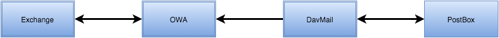
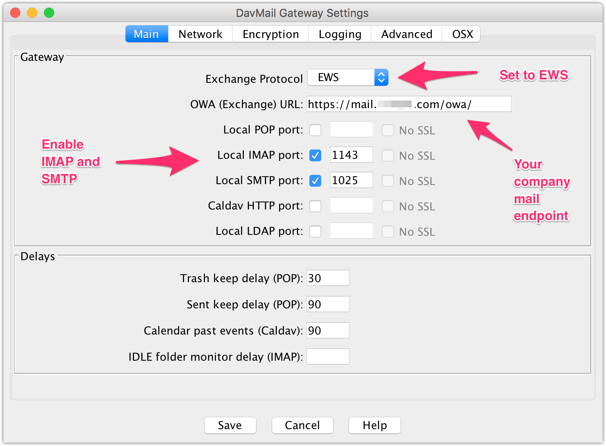
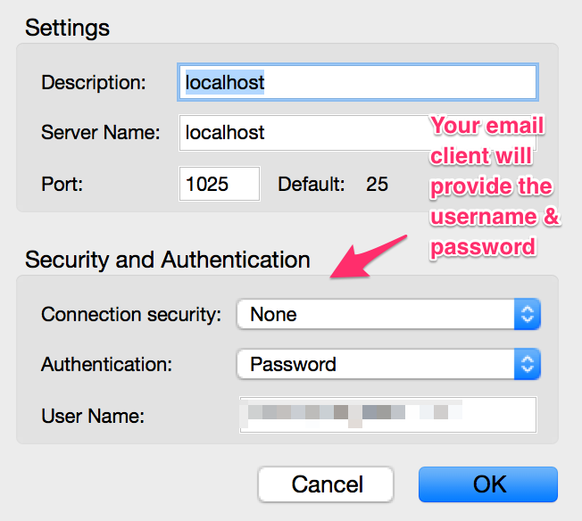
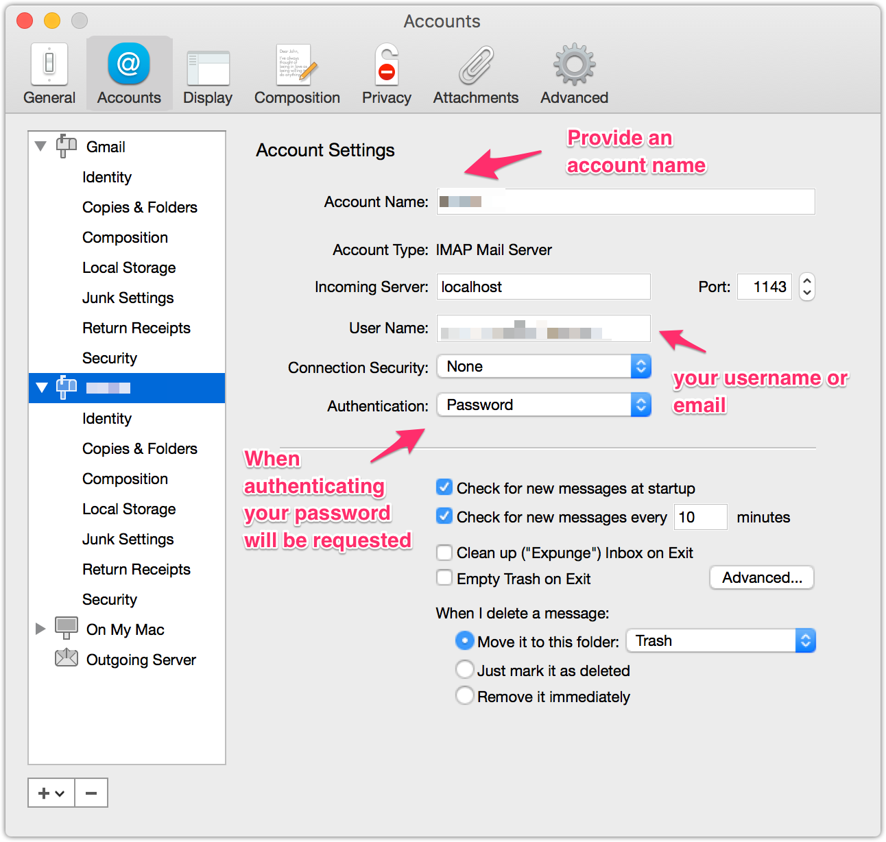
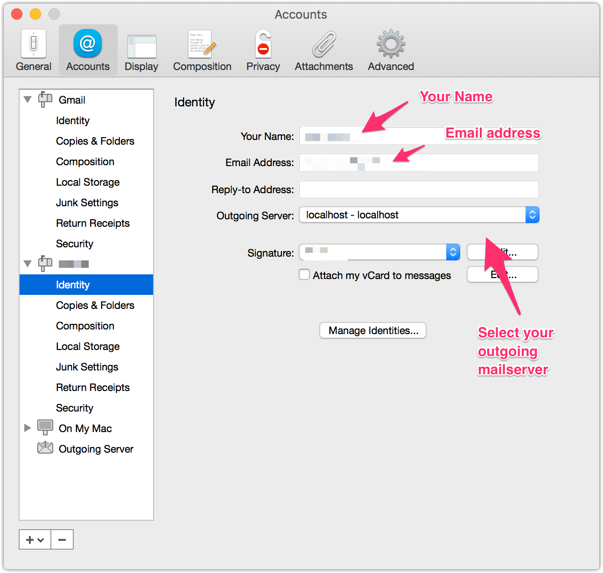

If you find yourself into a situation where you have a need for non Microsoft mail client that needs support for Microsoft Exchange then you are often out of luck. In my case I needed Exchange support for the terrific [PostBox](http://www.postbox-inc.com) mail client.

As for now PostBox does not support Microsoft Exhange natively so the hunt starts on how to get Exchange working. As it stands most companies also enable Exchange Web Access (or Outlook Web Access [OWA]) so maybe we can use that to feed our native mail client.

Enter the use of [DavMail](http://davmail.sourceforge.net/)!

#### Davmail Gateway

Davmail is a local mail proxy that can work together with Microsoft Exchange [OWA] in a way that DavMail is actually connecting to a Exchange OWA and your mail client connects to DavMail as a proxy.

#### Configure Davmail

In order to get DavMail working correctly you need to provide the correct settings so it can use the OWA endpoint.

#### Configure PostBox

In order to get PostBox working with DavMail you need to create an outgoing mail server and an account that will use that outgoing mailserver.

#### Configure PostBox - Outgoing mailserver

#### Configure PostBox - Account setup

#### Configure PostBox - Identity setup

Now you are ready to send mail using your PostBox Client using DavMail and OWA.
